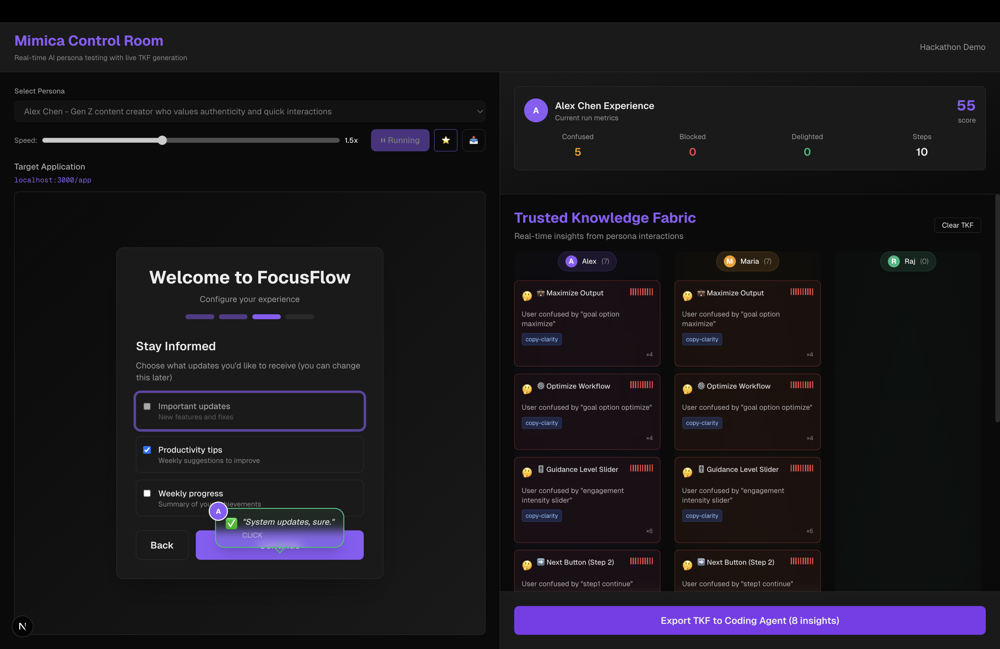

## Mimica – AI Personas + Trusted Knowledge Fabric for UX Testing

Mimica is an AI-powered UX testing lab. Simulated personas interact with your app, think out loud in real time, and weave their feedback into a **Trusted Knowledge Fabric (TKF)** of insights. That TKF is then exported to an AI coding agent (for example, Cursor) to improve the UI, and personas re-run so you can see measurable before/after UX gains.

---

### Overview

- **Target app**: A 4-step onboarding flow for a fictional productivity product, FocusFlow.
- **Control Room**: A dedicated Mimica UI where you:
  - Pick personas and scenarios.
  - Watch **thought bubbles** appear directly on the app as personas “think”.
  - See **knowledge threads** flow into the TKF fabric on the right.
  - Compare **before vs after** runs via a Persona Scorecard.
  - Export TKF as a markdown report for an AI coding agent.

The current implementation uses **hand-authored simulation sequences** (scripted personas) with a fully interactive demo UI. LLM and Playwright integrations are planned as the next step (see the backlog section).

---

### Screenshot



---

### Getting Started

#### Prerequisites

- Node.js 18+ (recommended)
- npm (comes with Node)

#### Install dependencies

```bash
npm install
```

#### Run the dev server

From the repo root:

```bash
npm run dev
```

Then open:

- Control Room: `http://localhost:3000/lab`
- Target app only (FocusFlow): `http://localhost:3000/app`
- Landing page: `http://localhost:3000/`

---

### Main Screens

#### Control Room – `/lab`

- **Top bar**
  - Title: Mimica Control Room.
  - Hidden backup toggle: press `b` to reveal the v1/v2 (backup) switch for the target app.

- **Left column**
  - Persona selector and speed control.
  - Run Simulation / (future) Run All Personas controls.
  - Target Application preview: embedded FocusFlow onboarding flow.
  - Thought Bubbles: persona reasoning overlaid directly above UI elements as they act.

- **Right column**
  - Persona Scorecard: shows run metrics (confusion, blocked, delighted, steps, time, severity) and **before/after** comparison once a baseline is set.
  - Trusted Knowledge Fabric (TKF):
    - Fabric-style view with persona lanes.
    - Each tile is an insight (confusion, friction, delight, opportunity).
    - Resolved / improved insights visually distinguished.
    - Small knowledge thread animation from the left app to the TKF when new insights appear.

#### Target App – `/app`

- FocusFlow onboarding UI:
  - Multiple steps, CTAs, and options instrumented with `data-element-id`s.
  - Designed so some variants are confusing (v1) and others are improved (v2) to make the TKF & scorecard changes obvious.

---

### How to Run the Demo

You’ll find a full script in:

- `DEMO_GUIDE.md` – long-form demo script, talking points, and troubleshooting.
- `DEMO_QUICK_REFERENCE.md` – short cheat sheet.

High-level flow:

1. Start from `/lab`:
   - Select a persona (for example, Raj, Alex, or Maria).
   - Ensure UI version is v1 (live “before” variant).
2. Run a simulation:
   - Click **Run Simulation**.
   - Watch the persona interact:
     - Elements highlight.
     - Thought bubbles show what they’re thinking.
     - Knowledge threads flow into TKF; new insight tiles appear.
3. Set a baseline:
   - After a run completes, click **Set as Baseline**.
   - The Persona Scorecard now treats this run as the “before” reference.
4. Export TKF for coding agent:
   - Open the **Export TKF** modal.
   - Copy the Markdown report into Cursor (or your AI coding agent of choice).
   - Ask the agent to improve the onboarding UI (`components/onboarding/OnboardingFlow.tsx`) based on the insights.
5. Apply changes & hot reload:
   - Let the AI agent modify the UI file.
   - Save changes; Next.js hot reload will update the embedded app.
6. Re-run the persona:
   - Run the same persona again on the improved UI.
   - Persona Scorecard shows before/after metrics.
   - TKF marks some insights as resolved or improved.

Optional:

- Use the hidden `b` key to toggle the v1/v2 backup switch if you need a manual “before/after” variant as a fallback.

---

### Project Structure (High Level)

- **App & Pages**
  - `app/page.tsx` – landing page.
  - `app/lab/page.tsx` – Mimica Control Room.
  - `app/app/page.tsx` – FocusFlow onboarding-only view.

- **Target UI**
  - `components/onboarding/OnboardingFlow.tsx` – onboarding wizard (v1/v2).

- **Simulation & State**
  - `lib/types/index.ts` – core types (`Persona`, `SimulationStep`, `TKFInsight`, etc.).
  - `lib/data/personas.ts` – persona definitions.
  - `lib/data/scenarios.ts` – task scenarios.
  - `lib/data/simulation-sequences.ts` – handcrafted `SimulationStep` sequences.
  - `lib/simulation/engine.ts` – simulation engine.
  - `lib/simulation/SimulationContext.tsx` – React context for simulation state, metrics, TKF, baseline, etc.

- **TKF & Reporting**
  - `lib/tkf/aggregator.ts` – builds and updates TKF insights from steps.
  - `lib/utils/elementLabels.ts` – human-readable labels for UI element IDs.
  - `lib/tkf/export.ts` – generates TKF Markdown report for coding agents.
  - `components/lab/TKFView.tsx` – TKF “fabric” UI.
  - `components/lab/PersonaScorecard.tsx` – before/after scorecard.
  - `components/lab/ExportModal.tsx` – TKF export modal.

- **Visualization & UX**
  - `components/lab/ThoughtBubble.tsx` – persona reasoning bubbles over the app.
  - `components/lab/InsightStream.tsx` – animated “knowledge thread” from thought bubble to TKF.
  - `app/globals.css` – Tailwind + custom theme, animations, and layout tweaks.

- **Docs & Planning**
  - `DEMO_GUIDE.md` – full demo flow.
  - `DEMO_QUICK_REFERENCE.md` – short script.
  - `MIMICA_HACKATHON_PLAN.md` – prioritized backlog & workstreams for the hackathon.

---

### Current Status vs Roadmap

- **Implemented now**
  - Scripted personas with detailed, step-by-step reasoning.
  - Thought bubbles on the live UI.
  - TKF aggregation with resolved/improved logic.
  - Knowledge thread animation from app → TKF.
  - Persona scorecard with baseline comparison.
  - Export to markdown for coding agents.

- **Planned / WIP**
  - Real LLM-driven personas (bounded, safe action set).
  - Playwright-based real browser runner.
  - “Run All Personas” orchestration.
  - TKF evidence drill-down and further UX polish.

---

### Tech Stack

- Next.js (App Router) + React + TypeScript
- Tailwind CSS for styling

Hot reload is used heavily in the demo (especially for the “coding agent” story), so keep `npm run dev` running during development and during the hackathon demo.
